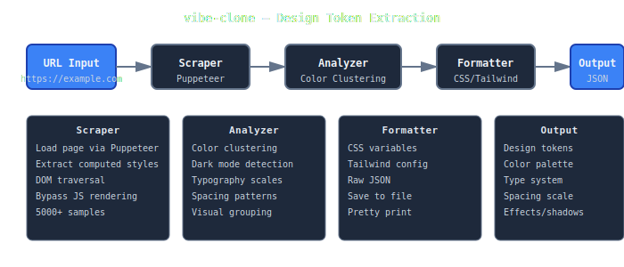

# vibe-clone

Extract design tokens from any website. Scrapes with Puppeteer, analyzes computed styles, outputs CSS variables, Tailwind config, or JSON.

## Features

- Scrapes live websites via Puppeteer (handles JavaScript-heavy sites)
- Analyzes all computed DOM styles (not just stylesheets)
- Intelligent color clustering by hue + lightness for semantic meaning
- Dark mode detection via luminosity analysis
- Typography extraction (fonts, sizes, weights)
- Spacing scale detection (base-8 or base-4)
- Visual effects collection (shadows, borders, radius)
- Multiple output formats: CSS variables, Tailwind, JSON
- TypeScript strict mode, 37 tests, 76% coverage

## Quick Start

```bash
git clone https://github.com/nulljosh/vibe-clone.git
cd vibe-clone

npm install
npm run build
npm run dev -- https://stripe.com
```

## Usage

```bash
# CSS variables (default)
npm run dev -- https://stripe.com

# Tailwind config
npm run dev -- https://linear.app --format tailwind -o tailwind.config.js

# JSON for scripting
npm run dev -- https://vercel.com --format json | jq .palette

# Save to file
npm run dev -- https://apple.com -o design-tokens.css

# Browser visible (debug)
npm run dev -- https://example.com --headless false
```

## Architecture



## Stack

- TypeScript 5.0 (strict mode)
- Puppeteer 21 (headless Chrome)
- Jest 29 (37 tests, 76% coverage)
- Commander.js (CLI parsing)
- tinycolor2 (color manipulation)

## Testing

```bash
npm test                    # Run all tests
npm test:watch             # Watch mode
npm test:coverage          # Coverage report
```

All 37 tests passing. Coverage: 76% statements, 92% functions.

## Dev

```bash
npm install
npm run build              # TypeScript → JavaScript
npm run dev -- <url>       # Run with ts-node
npm run lint               # ESLint check
npm run format             # Prettier format
npm run clean              # Remove artifacts
```

## License

MIT
